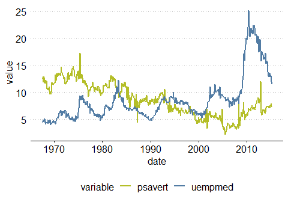
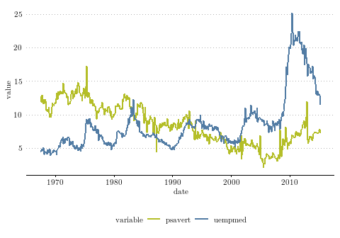

<!-- README.md is generated from README.Rmd. Please edit that file -->

# zewplot

<!-- badges: start -->
<!-- badges: end -->

The package `zewplot` implements the function `zew_plotstyle()`

## Installation

It is necessary to install the `devtools` package. Then, `zewplot` can
be installed from GitHub:

``` r
install.packages('devtools')
library(devtools)
install_github('benediktstelter/zewplot')
```

## Example

``` r
library(tidyverse)
library(zewplot)
# Data preparation
df <- economics %>%
  select(date, psavert, uempmed) %>%
  gather(key = "variable", value = "value", -date)
#Plotting using zew_plotstyle
example_plot <- ggplot(df, aes(x = date, y = value)) + 
  geom_line(aes(color = variable), size = 1) +
  scale_color_manual(values = c("#b4be28", "#527ca4")) +
  zew_plotstyle()
```



It is also possible to select a custom font and change the font size
(default font size is 12) through the arguments `font` and `font_size`:

``` r
#Load custom font (e.g. Latin Modern Roman 10: "LaTeX Font")
library(showtext)
font_add(family = "Latin Modern Roman 10", regular = "example/lmroman10-regular-webfont.ttf")
showtext_auto()
#Plotting using zew_plotstyle with custom font and custom font size
example_plot2 <- ggplot(df, aes(x = date, y = value)) + 
  geom_line(aes(color = variable), size = 1) +
  scale_color_manual(values = c("#b4be28", "#527ca4")) +
  zew_plotstyle(font = "Latin Modern Roman 10", font_size=8)
```


